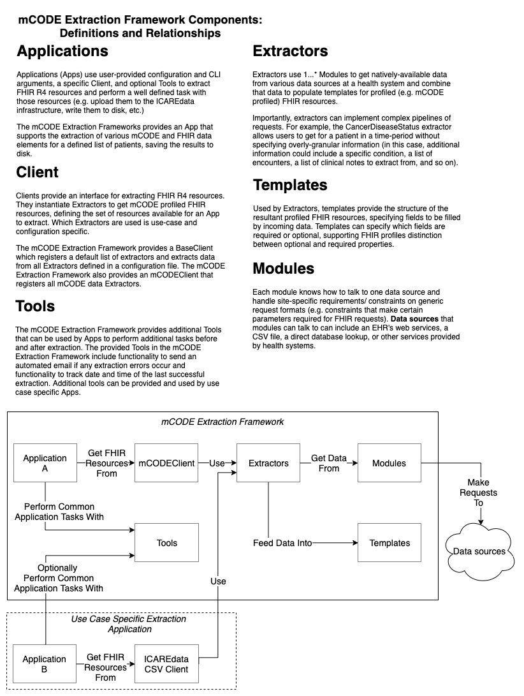
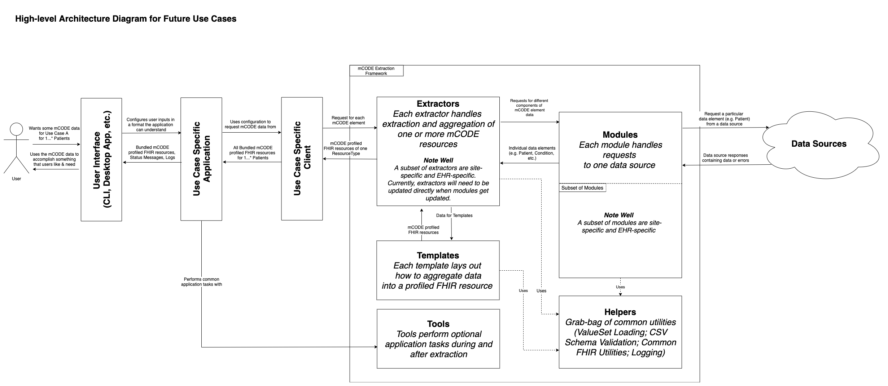

# mCODE Extraction Framework

A Node.js framework for extracting mCODE FHIR resources. All resources are profiled per the [mCODE v1.16.0 R4 FHIR Implementation Guide](http://hl7.org/fhir/us/mcode/2021May/)

## Table of Contents

- [mCODE Extraction Framework](#mcode-extraction-framework)
  - [Table of Contents](#table-of-contents)
  - [Prerequisites](#prerequisites)
    - [Latest](#latest)
  - [Framework Usage](#framework-usage)
  - [Client Usage](#client-usage)
    - [First Time User Guide](#first-time-user-guide)
      - [CSV File Formats: Steps 1 & 2](#csv-file-formats-steps-1--2)
      - [Configuration Files: Step 3](#configuration-files-step-3)
    - [Configuration Deep Dive](#configuration-deep-dive)
    - [Email Notification](#email-notification)
    - [Logging Successful Extractions](#logging-successful-extractions)
    - [Masking Patient Data](#masking-patient-data)
    - [Extraction Date Range](#extraction-date-range)
      - [CLI From-Date and To-Date (NOT recommended use)](#cli-from-date-and-to-date-not-recommended-use)
    - [Troubleshooting](#troubleshooting)
      - [NULL/NIL values found and replaced with empty-strings](#nullnil-values-found-and-replaced-with-empty-strings)
      - [Byte Order Markers in CSV Files](#byte-order-markers-in-csv-files)
  - [Terminology and Architecture](#terminology-and-architecture)
    - [Glossary](#glossary)
    - [High Level Diagram](#high-level-diagram)
  - [License](#license)

## Prerequisites

- [Node.js v14.18.1 (LTS as of Oct 2021)](https://nodejs.org/en/)
  - npm v6.14.15 (included in LTS of Oct 2021)

### Latest

```bash
npm install --save git+https://github.com/mcode/mcode-extraction-framework.git
```

## Framework Usage

There are various extractors, modules, and helper functions exposed by the framework that can be imported and used in your project. The framework also exposes a logger designed for outputting log statements to the console during extraction. The framework's exports can be seen in the [index.js file](https://github.com/mcode/mcode-extraction-framework/blob/master/src/index.js).

Each extractor exposes an asynchronous `get` function that will return a bundle of extracted mCODE data.

```JavaScript
// Example
const { CSVCancerDiseaseStatusExtractor, logger} = require('mcode-extraction-framework');

// Instantiate extractor with base URL and any additional request headers
const cancerDiseaseStatusExtractor = new CSVCancerDiseaseStatusExtractor({ filePath: 'path-to-csv' });

(async () => {
  logger.info('Extracting primary disease status data');
  const primaryDiseaseStatusBundle = await cancerDiseaseStatusExtractor.get({ mrn: 'some-mrn' });
})();
```

## Client Usage

The framework also contains the [MCODEClient](src/client/MCODEClient.js) which has registered all of the extractors in this repo. Once you have exported CSV data and updated your configuration file, use the mCODE Extraction client by running the following:

```bash
npm start -- [options]
```

To see all the options that can be used with the mCODE client, run the following:

```bash
npm start -- --help
```

### First Time User Guide

To run the mCODE Extraction Client you must have:

1. A CSV file at `data/patient-mrns.csv` that contains a list of all MRN's to be extracted;
2. CSV files containing the patient data to transform into mCODE data;
3. A configuration file that points to your data and provides additional information.

#### CSV File Formats: Steps 1 & 2

CSV data for each extractor is expected in the `data` directory. The CSV schema for each data element is located in [docs](docs). The two patient CSV files below are necessary for the client to run.

- `data/patient-mrns.csv` which adheres to the [Patient MRN's CSV Schema](docs/patient-mrns.csv)
- `data/patient-information.csv` which adheres to the [Patient CSV Schema](docs/patient.csv)

Examples files for these extractor can be found in the [`test/sample-client-data`](test/sample-client-data) directory. Files there provide examples of the values that are expected in each column, but they are not based on any real patient data.

#### Configuration Files: Step 3

After exporting your CSV files to the `data` directory, kickstart the creation of a configuration file by renaming the provided `csv.config.example.json` to `csv.config.json`. Then, ensure the following configuration parameters are properly set:

1. `patientIdCsvPath` should correspond to an absolute file path to a CSV file containing MRN's for relevant patients;
2. `commonExtractorArgs.dataDirectory` should correspond to an absolute path to the dataDirectory containing all your exported CSV files;
3. For each extractor, `fileName` should correspond to the file name this extractor should be reading from. Note: combining the `dataDirectory` above and `fileName` should resolve to a file on disk containing this corresponding extractor's data;

For instructions on setting up an email notification trigger whenever an error is encountered in extraction, see the [Email Notification](#Email-Notification) section below.

### Configuration Deep Dive

Each deployment of the mCODE Extraction Client needs a configuration file. This file will specify basic information that every run will use. The configuration file can live in the `config` directory or any directory you prefer. An illustrative example file can be found in [`config/csv.config.example.json`](config/csv.config.example.json).

To specify which patients the client should extract data for, the configuration file _must_ point to a CSV file containing MRNs for each patient. The format for this file can be found [here](https://github.com/mcode/mcode-extraction-framework/blob/master/docs). An example of this file can be found in [`test/sample-client-data/patient-mrns.csv`](test/sample-client-data/patient-mrns.csv).

Each extractor uses various methods to gather data and format that data into [mCODE](http://hl7.org/fhir/us/mcode/index.html) profiled resources. The `observation` extractor formats data into a general [FHIR R4](http://hl7.org/fhir/R4) profile. Extractors may require additional configuration items that can be specified in the configuration file.

### Email Notification

The mCODE Extraction Client supports sending an email using the SMTP protocol when there are errors during data extraction.
The connection to the SMTP server is considered authenticated from the start. Currently, there is no support for providing authentication information separately through configuration.

In order to send an email, users must specify the hostname or IP address of an SMTP server to connect to and the email addresses to send the email to. Optionally, users can specify the port to connect to and the email address to send from. These fields must be specified in the `notificationInfo` object in the configuration file. Below is more information on each field that can be specified. Further information can be found in the [`nodemailer` documentation](https://nodemailer.com/) for the [SMTP transport](https://nodemailer.com/smtp/) and [message configuration](https://nodemailer.com/message/).

- `host`: `<string>` The hostname or IP address of an SMTP server to connect to
- `port`: `<number>` (Optional) The port to connect to (defaults to 587)
- `to`: `<string[]>` Comma separated list or an array of recipients email addresses that will appear on the _To:_ field
- `from`: `<string>` (Optional) The email address of the sender. All email addresses can be plain `'sender@server.com'` or formatted `'"Sender Name" sender@server.com'` (defaults to mcode-extraction-errors@mitre.org, which cannot receive reply emails)
- `tlsRejectUnauthorized`: `<boolean>` (Optional) A boolean value to set the [node.js TLSSocket option](https://nodejs.org/api/tls.html#tls_class_tls_tlssocket) for rejecting any unauthorized connections, `tls.rejectUnauthorized`. (defaults to `true`)

An example of this object can be found in [`config/csv.config.example.json`](config/csv.config.example.json).

If the `notificationInfo` object is provided in configuration, an email will be sent using the specified options if any errors occur during data extraction. If any required field is missing in the object (`host` or `to`), an email cannot be sent. If you prefer to not have an email sent even if errors occur, you can choose to not include the `notificationInfo` object in your configuration file.

### Logging Successful Extractions

Whenever the mCODE Extraction Client successfully runs with the `--entries-filter` flag, a log is kept of the given date range of the extraction. The default location of the log is in a `logs` directory in a file called `run-logs.json`. If there is no log file at that location, the file will be created the first time the user runs the program with the `--entries-filter` flag.

Users can specify a different location for the file by using the `--run-log-filepath <path>` CLI option. Users will need to create this file before running the mCODE Extraction Client with `--entries-filter` and a date range. Initially, this file's contents should be an empty array, `[]`. For example:

```bash
npm start -- --entries-filter --from-date YYYY-MM-DD --to-date YYY-MM-DD --run-log-filepath path/to/file.json
```

### Masking Patient Data

Patient data can be masked within the extracted `Patient` resource. When masked, the value of the field will be replaced with a [Data Absent Reason extension](https://www.hl7.org/fhir/extension-data-absent-reason.html) with the code `masked`.
Patient properties that can be masked are: `genderAndSex`, `mrn`, `name`, `address`, `birthDate`, `language`, `ethnicity`, `race`, `telecom`, `multipleBirth`, `photo`, `contact`, `generalPractitioner`, `managingOrganization`, and `link`.
To mask a property, provide an array of the properties to mask in the `constructorArgs` of the Patient extractor. For example, the following configuration can be used to mask `address` and `birthDate`:

```bash
{
  "label": "patient",
  "type": "CSVPatientExtractor",
  "constructorArgs": {
    "filePath": "./data/patient-information.csv"
    "mask": ["address", "birthDate"]
  }
}
```

Alternatively, providing a string with a value of `all` in the `constructorArgs` of the Patient extractor will mask all of the supported properties listed above. The following configuration can be used to mask all properties of the `Patient` resource, rather than listing each individual property:

```bash
{
  "label": "patient",
  "type": "CSVPatientExtractor",
  "constructorArgs": {
    "filePath": "./data/patient-information.csv"
    "mask": "all"
  }
}
```

### Extraction Date Range

The mCODE Extraction Client will extract all data that is provided in the CSV files by default, regardless of any dates associated with each row of data. It is recommended that any required date filtering is performed outside of the scope of this client.

If for any reason a user is required to specify a date range to be extracted through this client, users _must_ add a `dateRecorded` column in every relevant data CSV file. This column will indicate when each row of data was added to the CSV file. Note that this date _does not_ correspond to any date associated with the data element.

Note that some resources should always be included and should not be filtered out with a `dateRecorded` column and date. For example, every extraction should extract patient information to a Patient resource, so no `dateRecorded` column should be provided in a CSV that contains the Patient information.

#### CLI From-Date and To-Date (NOT recommended use)

If any filtering on data elements in CSV files is required, the `entries-filter` option must be used. The remaining instructions in this section assume this flag is provided.

If a `from-date` is provided as an option when running the mCODE Extraction Client, it will be used to filter out any data elements that are recorded before that date based on the `dateRecorded` column in the CSV files. If a `to-date` is provided as an option, it will be used to filter out any data elements that are recorded after that date based on the `dateRecorded` column in the CSV files. If no `to-date` is provided, the default is today. If no `from-date` is provided, the mCODE Extraction Client will look to a run log file (details [above](#Logging-Successful-Extractions)) to find the most recent run and use the `to-date` of that run as the `from-date` for the current run, allowing users to only run the extraction on data elements that were not included in previous runs. If there are no previous run times logged, a `from-date` needs to be provided when running the extraction when the `entries-filter` option is provided. If the `entries-filter` option is not provided, any `from-date` and `to-date` options will be ignored, none of the data elements will be filtered by date, and a successful run will not be logged since there is no specified date range. An example running the client with the `from-date` and `to-date` is as follows:

```bash
npm start -- --entries-filter --from-date <YYYY-MM-DD> --to-date <YYYY-MM-DD> --config-filepath <path>
```

### Troubleshooting

#### NULL/NIL values found and replaced with empty-strings

When CSV files are provided containing NULL/NIL values, those values are treated as empty values and are translated into ''. Each Extractor, however, defines a set of `unalterableColumns` which will be immune from this NULL/NIL correction. All values that are corrected will produce a `debug`-level message, and can be seen by running the extractor with the debug flag set.

#### Byte Order Markers in CSV Files

The extraction client has built-in handling of byte order markers for CSV files in UTF-8 and UTF-16LE encodings. When using CSV files in other encodings, if you experience unexpected errors be sure to check for a byte order marker at the beginning of the file. One way to check is to run the following command from the command line:

```bash
cat -v <file.csv>
```

If there is an unexpected symbol at the beginning of the file, then there may be a byte order marker that needs to be removed.

## Terminology and Architecture

This framework consists of three key components: Extractors, Modules and Templates. Below is, in order:

1. A glossary of what components of the mCODE Extraction Framework refer to;
2. A high-level explanation of how those components connect;

### Glossary



### High Level Diagram



These diagrams can be modified by updating the XML files in the `/docs/diagrams/` directory using draw.io or a company licensed equivalent.

## License

(C) 2020 The MITRE Corporation. All Rights Reserved.

Licensed under the Apache License, Version 2.0 (the "License"); you may not use this file except in compliance with the License. You may obtain a copy of the License at

    http://www.apache.org/licenses/LICENSE-2.0

Unless required by applicable law or agreed to in writing, software distributed under the License is distributed on an "AS IS" BASIS, WITHOUT WARRANTIES OR CONDITIONS OF ANY KIND, either express or implied. See the License for the specific language governing permissions and limitations under the License.
